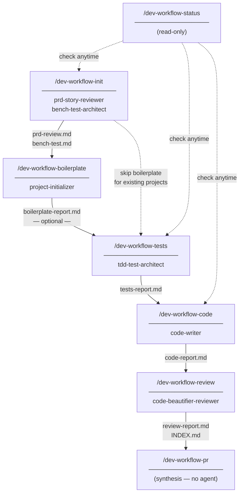
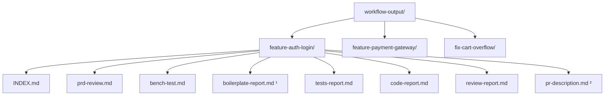
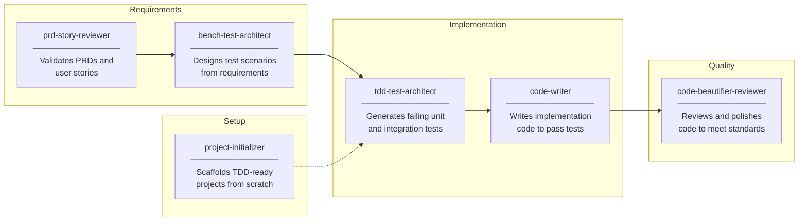

# Workflow

A development workflow built on top of Claude Code's agent system.

---

## Installation

The workflow is installed per-project by copying the `.claude/` folder into the root of your repository.

### 1. Clone this repository

```bash
git clone <repo-url> workflow
```

### 2. Copy `.claude/` into your project

```bash
cp -r workflow/.claude /path/to/your-project/
```

On Windows (PowerShell):
```powershell
Copy-Item -Recurse workflow\.claude your-project\
```

### 3. Verify the structure

After copying, your project should have:

```
your-project/
  .claude/
    agents/
      bench-test-architect.md
      code-beautifier-reviewer.md
      code-writer.md
      prd-story-reviewer.md
      project-initializer.md
      tdd-test-architect.md
    commands/
      dev-workflow-boilerplate.md
      dev-workflow-code.md
      dev-workflow-init.md
      dev-workflow-pr.md
      dev-workflow-review.md
      dev-workflow-status.md
      dev-workflow-tests.md
    rules/
      WORKFLOW_CONVENTIONS.md
```

### 4. Open your project in Claude Code

```bash
cd your-project
claude
```

The `/dev-workflow-*` commands will be available immediately.

> **Note:** `workflow-output/` is created automatically the first time you run a command. Add it to your `.gitignore` if you don't want to commit the generated artifacts.

--- Each feature goes through a structured pipeline — from requirements review to pull request — with every decision documented in a per-feature folder that serves as the audit trail for the entire development cycle.

---

## Pipeline



---

## Output structure

Each feature produces an isolated folder derived from the git branch name.



> ¹ Only present if `/dev-workflow-boilerplate` was run (greenfield projects).
> ² Only present if `/dev-workflow-pr` was run.

---

## Agents

Each command delegates work to one or more specialized agents defined in `.claude/agents/`.



---

## Commands

| Command | Description | Docs |
|---------|-------------|------|
| `/dev-workflow-init` | Review requirements and generate bench tests | [→](docs/commands/dev-workflow-init.md) |
| `/dev-workflow-boilerplate` | Scaffold a TDD-ready project | [→](docs/commands/dev-workflow-boilerplate.md) |
| `/dev-workflow-tests` | Generate failing TDD test files | [→](docs/commands/dev-workflow-tests.md) |
| `/dev-workflow-code` | Write implementation to pass tests | [→](docs/commands/dev-workflow-code.md) |
| `/dev-workflow-review` | Review and polish the implementation | [→](docs/commands/dev-workflow-review.md) |
| `/dev-workflow-pr` | Generate and optionally create the PR | [→](docs/commands/dev-workflow-pr.md) |
| `/dev-workflow-status` | Check pipeline progress at any time | [→](docs/commands/dev-workflow-status.md) |

---

## Configuration

Shared conventions — branch resolution logic, output directory structure, artifact header format — are defined in `.claude/rules/WORKFLOW_CONVENTIONS.md`. Edit that file to change behavior across all commands at once.
