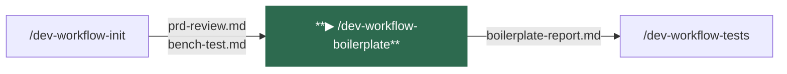
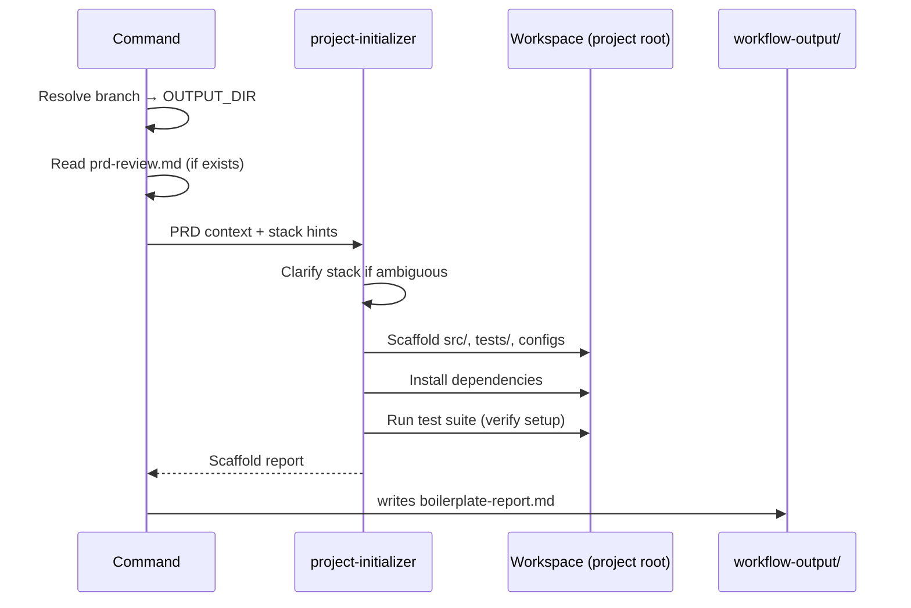
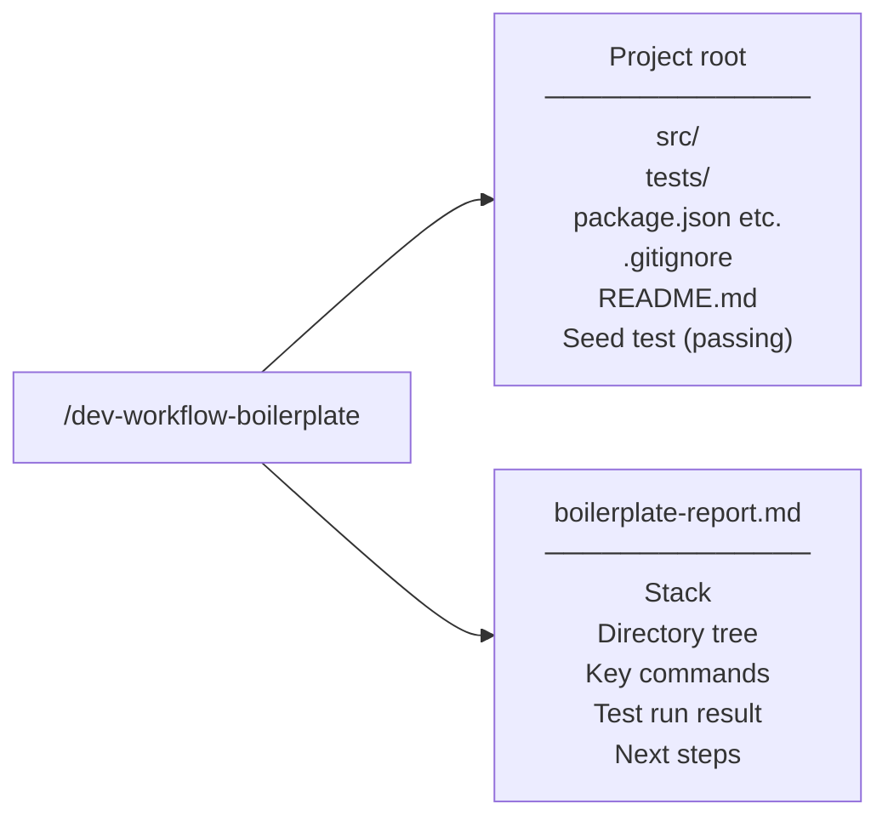

# /dev-workflow-boilerplate

Scaffolds a complete TDD-ready project from scratch. Optional — only needed for greenfield projects. For existing codebases, skip directly to [/dev-workflow-tests](dev-workflow-tests.md).

---

## Position in pipeline



---

## Usage

```
/dev-workflow-boilerplate [optional stack hints]
```

**Examples:**
```
/dev-workflow-boilerplate

/dev-workflow-boilerplate Node.js REST API with Express

/dev-workflow-boilerplate Python CLI with pytest
```

If no hints are provided and `prd-review.md` exists, the stack is inferred from the requirements automatically.

---

## What it does



1. **Resolves the output directory** from the current git branch
2. **Reads `prd-review.md`** if it exists — uses it to infer the appropriate stack without asking
3. **Invokes `project-initializer`** — clarifies language, framework, test framework, and package manager if not inferable; then scaffolds the full project
4. **Verifies the setup** — installs dependencies and runs the test suite to confirm everything works out of the box
5. **Writes `boilerplate-report.md`** — documents the stack chosen, directory structure, and key commands

---

## Agents invoked

| Agent | Role |
|-------|------|
| `project-initializer` | Scaffolds the project structure, configures the test framework, creates a seed test, installs dependencies, and verifies the setup. |

---

## Inputs

| File | Required | Purpose |
|------|----------|---------|
| `OUTPUT_DIR/prd-review.md` | No | Stack inference from requirements |
| `$ARGUMENTS` | No | Explicit stack hints override inference |

> **Constraint:** `project-initializer` only operates on empty workspaces. If files already exist in the project root, it will stop and inform you.

---

## Outputs



| Artifact | Path | Description |
|----------|------|-------------|
| Project files | Project root | Full TDD-ready scaffold with passing seed test |
| `boilerplate-report.md` | `workflow-output/<feature>/boilerplate-report.md` | Stack reference used by subsequent commands |

---

## Navigation

| | |
|--|--|
| **← Previous** | [/dev-workflow-init](dev-workflow-init.md) |
| **Next →** | [/dev-workflow-tests](dev-workflow-tests.md) |
| **Status** | [/dev-workflow-status](dev-workflow-status.md) |
| **Home** | [README](../../README.md) |
