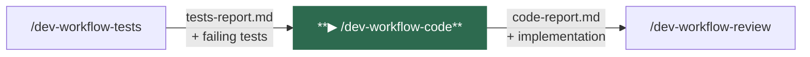
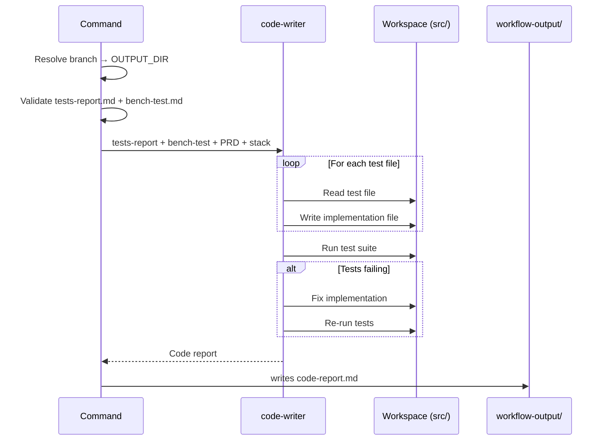
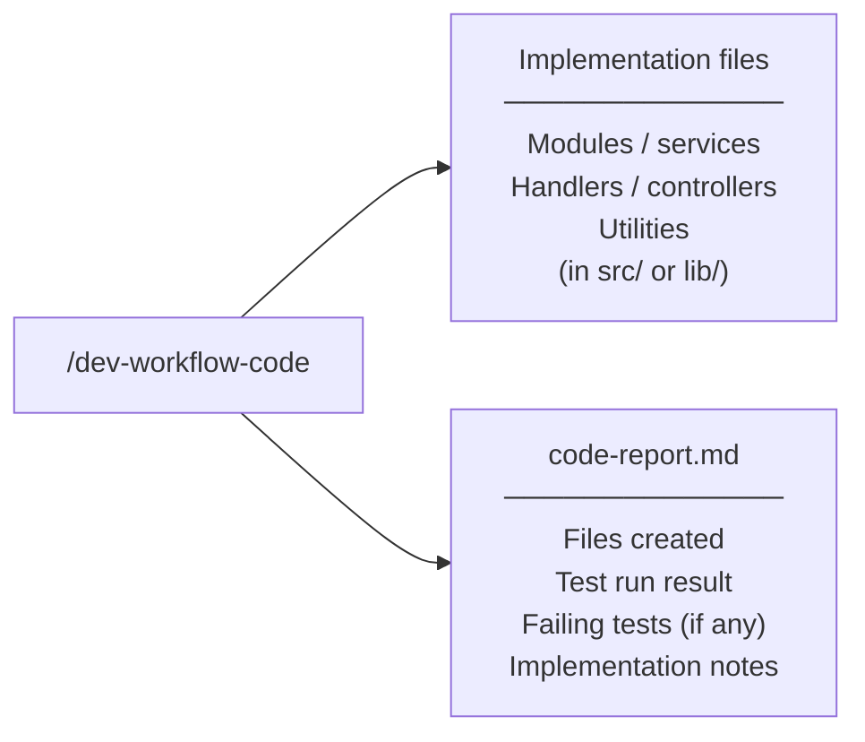

# /dev-workflow-code

Writes the implementation code to make all failing tests pass. Reads the test files directly to understand what needs to be implemented, then writes the simplest code that satisfies every test.

---

## Position in pipeline



---

## Usage

```
/dev-workflow-code
```

No arguments required. All inputs are read from `workflow-output/<feature>/` and the project source tree.

---

## What it does



1. **Resolves the output directory** from the current git branch
2. **Validates prerequisites** — stops if `tests-report.md` or `bench-test.md` are missing
3. **Invokes `code-writer`** — reads each test file, identifies what needs to be implemented, writes the most direct implementation possible, runs the test suite, and iterates until all tests pass
4. **Never modifies test files** — only writes implementation code; if a test appears incorrect, it is flagged in the report
5. **Writes `code-report.md`** — documents all files created, test run result, and key implementation decisions

---

## Agents invoked

| Agent | Role |
|-------|------|
| `code-writer` | Pragmatic implementation agent. Reads tests, writes the simplest code that makes them pass. Prioritizes correctness over elegance. |

---

## Inputs

| File | Required | Purpose |
|------|----------|---------|
| `OUTPUT_DIR/tests-report.md` | **Yes** | Map of test files to implement against |
| `OUTPUT_DIR/bench-test.md` | **Yes** | Scenario specs to guide implementation |
| `OUTPUT_DIR/prd-review.md` | No | Business rules and acceptance criteria |
| `OUTPUT_DIR/boilerplate-report.md` | No | Stack and project structure reference |

---

## Outputs



| Artifact | Path | Description |
|----------|------|-------------|
| Implementation files | Project source tree | All modules needed to make the test suite pass |
| `code-report.md` | `workflow-output/<feature>/code-report.md` | Files written, test results, key decisions |

---

## Navigation

| | |
|--|--|
| **← Previous** | [/dev-workflow-tests](dev-workflow-tests.md) |
| **Next →** | [/dev-workflow-review](dev-workflow-review.md) |
| **Status** | [/dev-workflow-status](dev-workflow-status.md) |
| **Home** | [README](../../README.md) |
