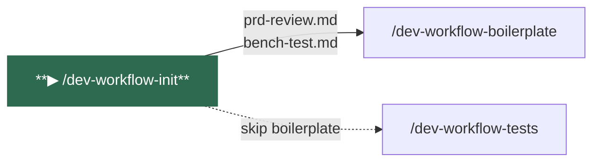
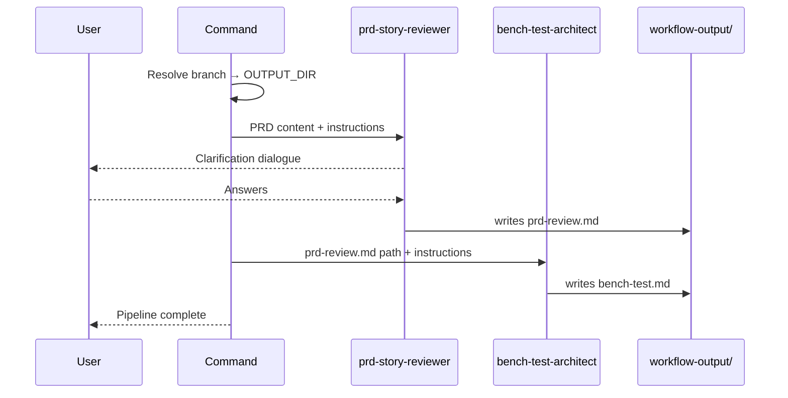
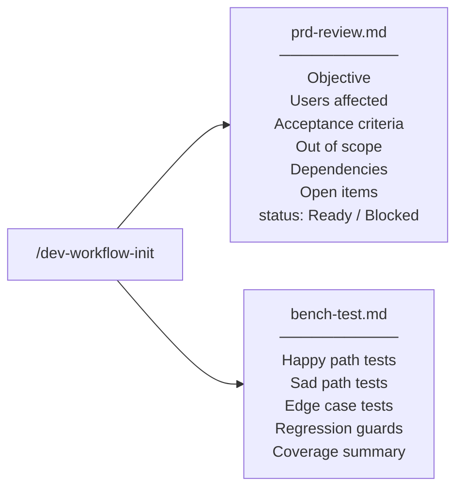

# /dev-workflow-init

Entry point for the workflow. Reviews and validates the requirements, then generates a comprehensive bench test suite. These two artifacts feed every subsequent step.

---

## Position in pipeline



---

## Usage

```
/dev-workflow-init <PRD content or card number>
```

**Examples:**
```
/dev-workflow-init Quero criar um sistema de login com email e senha, com bloqueio após 5 tentativas

/dev-workflow-init US-892

/dev-workflow-init #4521
```

---

## What it does



1. **Resolves the output directory** from the current git branch (see [WORKFLOW_CONVENTIONS](.././../rules/../.claude/rules/WORKFLOW_CONVENTIONS.md))
2. **Invokes `prd-story-reviewer`** — validates completeness, clarity, testability, and feasibility; runs a clarification dialogue with you if gaps are found
3. **Writes `prd-review.md`** — validated requirements in structured format
4. **Invokes `bench-test-architect`** — reads the validated PRD and maps every scenario to happy path, sad path, edge case, and regression tests
5. **Writes `bench-test.md`** — full test scenario suite

---

## Agents invoked

| Agent | Role |
|-------|------|
| `prd-story-reviewer` | Reviews the PRD for completeness, clarity, testability and feasibility. Runs an interactive clarification dialogue. |
| `bench-test-architect` | Reads the validated PRD and designs the full test scenario suite. |

---

## Inputs

| Source | Description |
|--------|-------------|
| `$ARGUMENTS` | PRD content pasted directly, or a card number (e.g. `#4521`, `US-892`) |

If a card number is provided, `prd-story-reviewer` fetches it from Azure DevOps via MCP.

---

## Outputs



| Artifact | Path | Description |
|----------|------|-------------|
| `prd-review.md` | `workflow-output/<feature>/prd-review.md` | Validated requirements with status field |
| `bench-test.md` | `workflow-output/<feature>/bench-test.md` | Full bench test scenario suite |

---

## Navigation

| | |
|--|--|
| **Next →** | [/dev-workflow-boilerplate](dev-workflow-boilerplate.md) — scaffold the project (optional) |
| **Or →** | [/dev-workflow-tests](dev-workflow-tests.md) — skip boilerplate for existing projects |
| **Status** | [/dev-workflow-status](dev-workflow-status.md) |
| **Home** | [README](../../README.md) |
