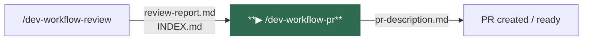
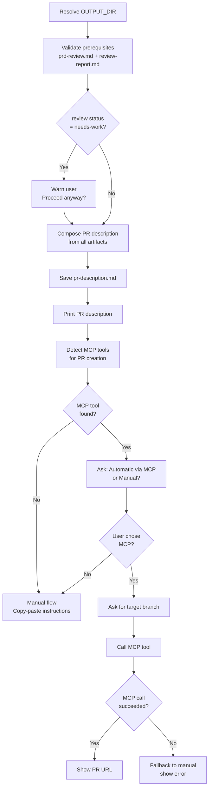
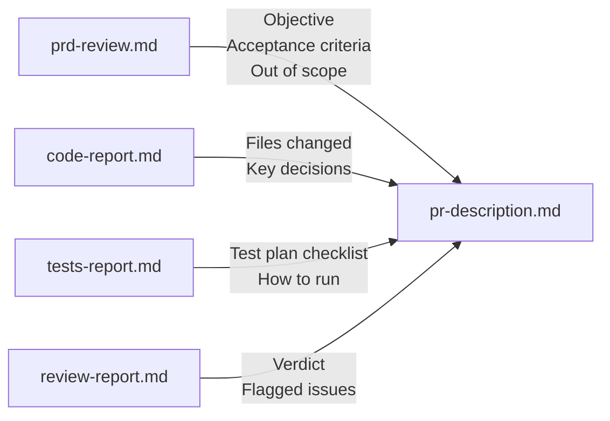
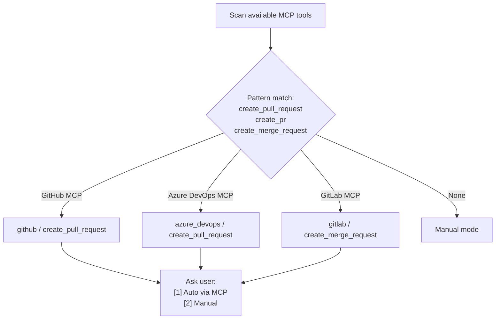

# /dev-workflow-pr

Consolidates all workflow artifacts into a complete pull request description. Detects available MCP integrations and offers to create the PR automatically — or falls back to a manual copy-paste flow.

---

## Position in pipeline



---

## Usage

```
/dev-workflow-pr
```

No arguments required. All inputs are read from `workflow-output/<feature>/`.

---

## What it does



---

## PR description structure

The description is composed directly from the artifacts — no agent is invoked.



| Section | Source | Description |
|---------|--------|-------------|
| Title | `prd-review.md` | `[type]: <feature description>`, max 72 chars |
| What / Why | `prd-review.md` | Objective and business motivation |
| In Scope | `prd-review.md` | Acceptance criteria as bullet list |
| Out of Scope | `prd-review.md` | Explicit exclusions |
| Files Changed | `code-report.md` | Implementation files and what they do |
| Key Decisions | `code-report.md` | Trade-offs and notable choices |
| Test Plan | `tests-report.md` | Scenarios as checkboxes, grouped by category |
| Review Notes | `review-report.md` | Verdict and any flagged issues |
| Pre-merge Checklist | — | Standard checklist |

---

## MCP integration



If a MCP tool is found, the command asks:
```
How would you like to create the PR?

  [1] Automatically via MCP (github / create_pull_request)
  [2] Manually — I'll paste the description myself
```

---

## Agents invoked

None. The PR description is synthesized directly from the artifacts without invoking an agent.

---

## Inputs

| File | Required | Purpose |
|------|----------|---------|
| `OUTPUT_DIR/prd-review.md` | **Yes** | Objective, acceptance criteria, scope |
| `OUTPUT_DIR/review-report.md` | **Yes** | Verdict and flagged issues |
| `OUTPUT_DIR/tests-report.md` | No | Test plan for checklist |
| `OUTPUT_DIR/code-report.md` | No | Files changed and implementation notes |
| `OUTPUT_DIR/INDEX.md` | No | Feature overview reference |

---

## Outputs

| Artifact | Path | Description |
|----------|------|-------------|
| `pr-description.md` | `workflow-output/<feature>/pr-description.md` | Complete PR description ready to use |
| PR (optional) | Remote repository | Created via MCP if the user chooses option 1 |

---

## Navigation

| | |
|--|--|
| **← Previous** | [/dev-workflow-review](dev-workflow-review.md) |
| **Status** | [/dev-workflow-status](dev-workflow-status.md) |
| **Home** | [README](../../README.md) |
