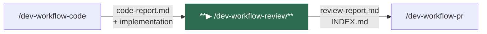
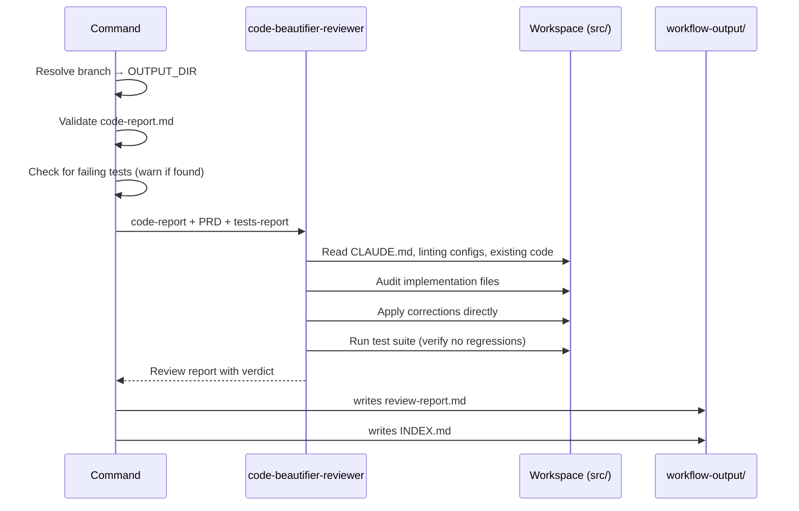
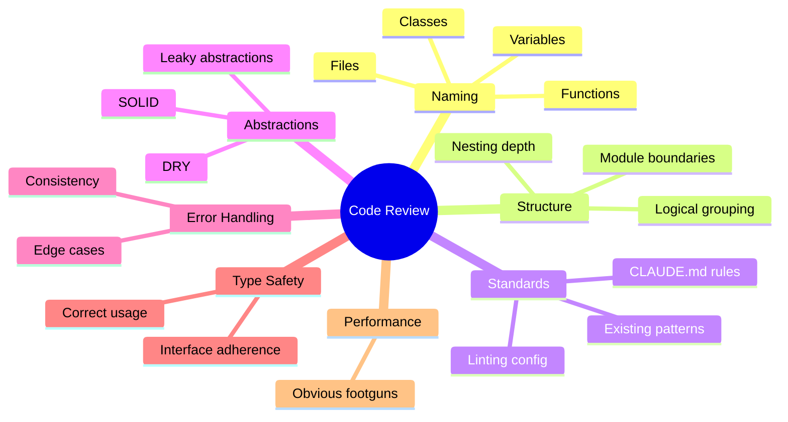
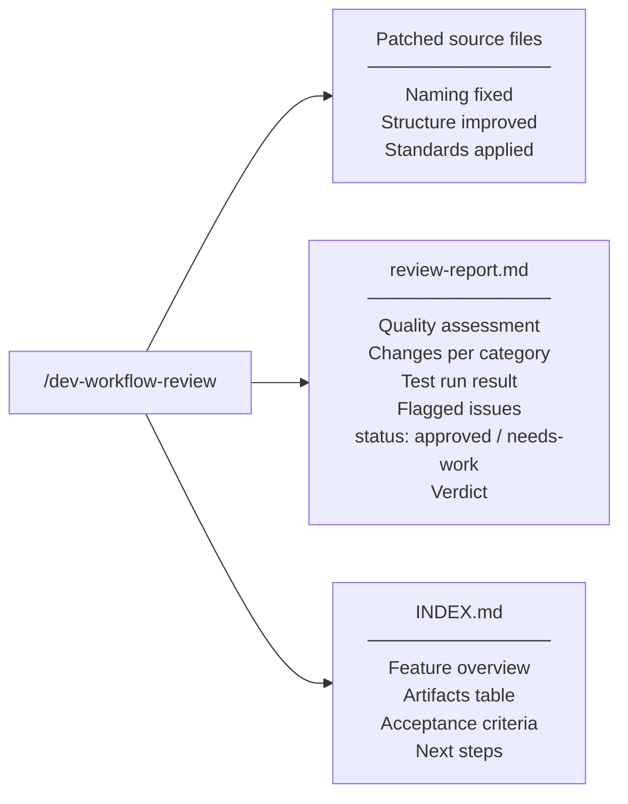

# /dev-workflow-review

Reviews and polishes the implementation against the project's coding standards. Applies corrections directly to source files, verifies no regressions, issues a formal verdict (`approved` / `needs-work`), and generates the feature's navigable `INDEX.md`.

---

## Position in pipeline



---

## Usage

```
/dev-workflow-review
```

No arguments required. All inputs are read from `workflow-output/<feature>/` and the project source tree.

---

## What it does



1. **Resolves the output directory** from the current git branch
2. **Guards against unresolved failures** — warns if `code-report.md` shows failing tests before proceeding
3. **Invokes `code-beautifier-reviewer`** — reads CLAUDE.md and existing code to internalize project standards, audits every implementation file, applies corrections, runs the suite to confirm no regressions
4. **Never touches test files** — issues in tests are flagged in the report, not silently changed
5. **Issues a formal verdict** — `approved` (no blocking issues) or `needs-work` (flagged issues require attention)
6. **Writes `review-report.md`** with changes made and verdict
7. **Writes `INDEX.md`** — navigable table of contents for all feature artifacts

---

## Review dimensions



---

## Agents invoked

| Agent | Role |
|-------|------|
| `code-beautifier-reviewer` | Senior code quality agent. Reads project standards, audits and corrects implementation files, verifies tests still pass, issues a formal verdict. |

---

## Inputs

| File | Required | Purpose |
|------|----------|---------|
| `OUTPUT_DIR/code-report.md` | **Yes** | List of implementation files to review |
| `OUTPUT_DIR/tests-report.md` | No | Test file list (to avoid reviewing test files) |
| `OUTPUT_DIR/prd-review.md` | No | Acceptance criteria to cross-check against |

---

## Outputs



| Artifact | Path | Description |
|----------|------|-------------|
| Patched source files | Project source tree | Implementation corrected to match project standards |
| `review-report.md` | `workflow-output/<feature>/review-report.md` | Changes made, test result, flagged issues, verdict |
| `INDEX.md` | `workflow-output/<feature>/INDEX.md` | Navigable index of all feature artifacts |

### Verdict rules

| Verdict | Condition |
|---------|-----------|
| `approved` | No flagged issues; all tests passing |
| `needs-work` | One or more flagged issues require attention before merging |

---

## Navigation

| | |
|--|--|
| **← Previous** | [/dev-workflow-code](dev-workflow-code.md) |
| **Next →** | [/dev-workflow-pr](dev-workflow-pr.md) |
| **Status** | [/dev-workflow-status](dev-workflow-status.md) |
| **Home** | [README](../../README.md) |
