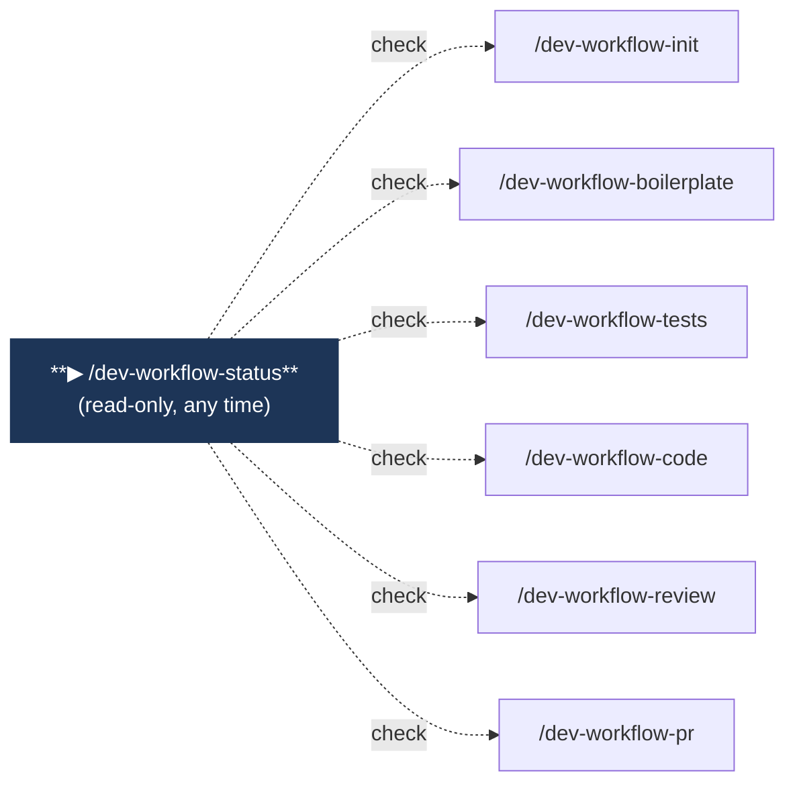
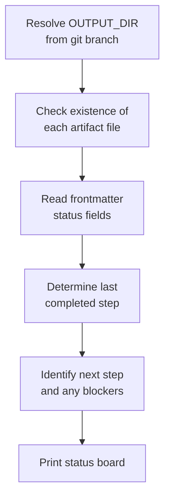
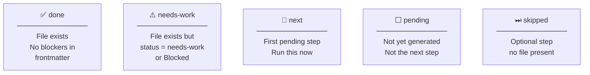

# /dev-workflow-status

Read-only command. Shows which pipeline steps are complete, which is next, and whether any artifact needs attention. Run it at any point without side effects.

---

## Position in pipeline



---

## Usage

```
/dev-workflow-status
```

No arguments required. Safe to run at any point — never modifies files or invokes agents.

---

## What it does



1. **Resolves the output directory** from the current git branch
2. **Probes each artifact** — checks existence and reads the `status:` field from frontmatter where present
3. **Calculates pipeline position** — last completed step, next step, any blockers
4. **Prints the status board**

---

## Output format

```
## Workflow Status — feature-auth-login
Output directory: `workflow-output/feature-auth-login/`

STEP  ARTIFACT                COMMAND                    STATUS
────  ──────────────────────  ─────────────────────────  ──────
 1    prd-review.md           /dev-workflow-init         ✅ done
 2    bench-test.md           /dev-workflow-init         ✅ done
 3    boilerplate-report.md   /dev-workflow-boilerplate  ⏭ skipped
 4    tests-report.md         /dev-workflow-tests        ✅ done
 5    code-report.md          /dev-workflow-code         🔄 next
 6    review-report.md        /dev-workflow-review       ⬜ pending

▶ Next: run `/dev-workflow-code` to write the implementation.
```

### Status icons



### Footer rules

| Situation | Footer message |
|-----------|---------------|
| All 6 steps done, no blockers | `✅ Workflow complete. Feature is ready for PR.` |
| Any step has `needs-work` or `Blocked` | `⚠️ Attention required in: <file> — <status>` |
| Steps in progress | `▶ Next: run <command>` |

---

## Inputs

| File | Required | Purpose |
|------|----------|---------|
| Any artifact in `OUTPUT_DIR/` | No | Existence check + frontmatter status read |

---

## Navigation

| | |
|--|--|
| **Home** | [README](../../README.md) |
| **All commands** | [init](dev-workflow-init.md) · [boilerplate](dev-workflow-boilerplate.md) · [tests](dev-workflow-tests.md) · [code](dev-workflow-code.md) · [review](dev-workflow-review.md) · [pr](dev-workflow-pr.md) |
