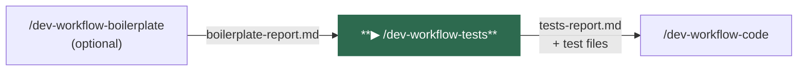
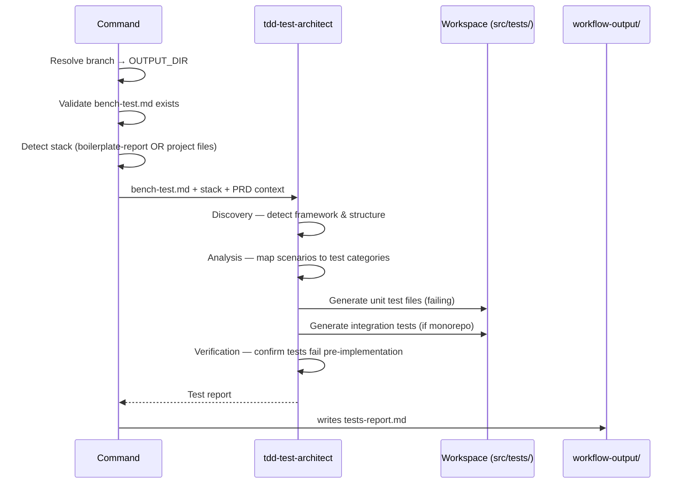
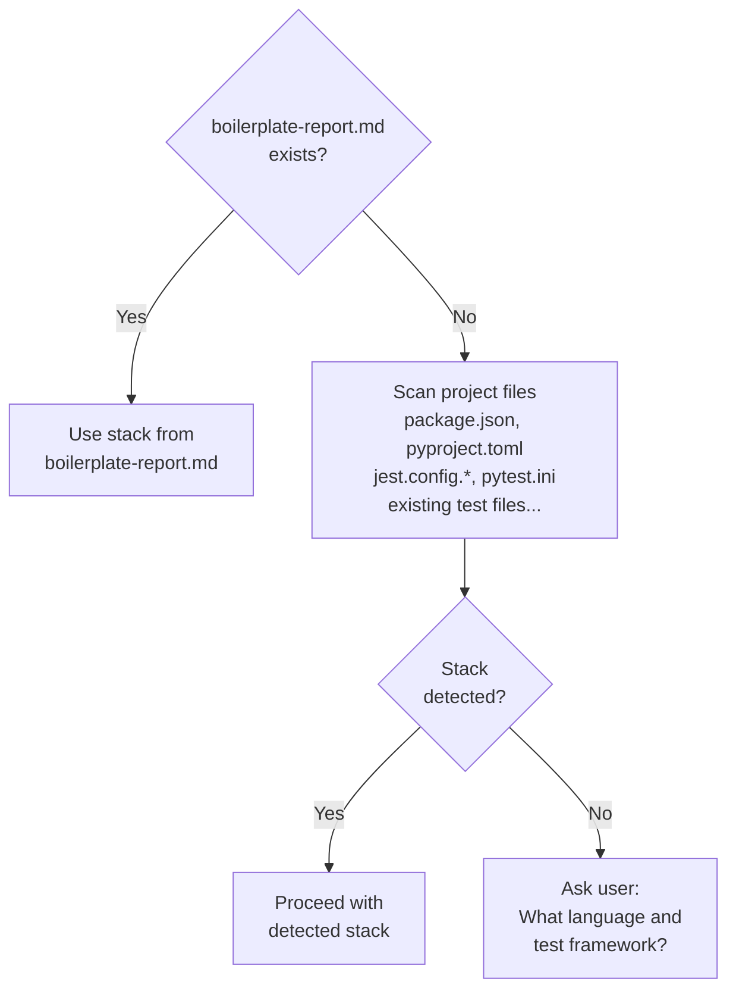
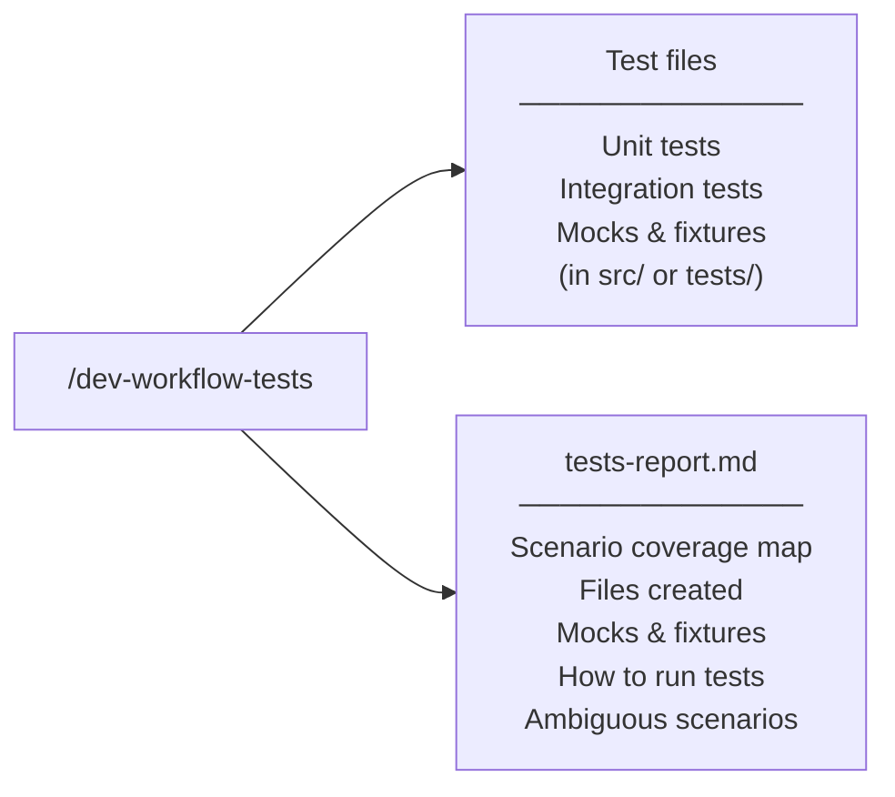

# /dev-workflow-tests

Translates the bench test scenarios from `bench-test.md` into real, failing test files placed in the project source tree. All tests are written in TDD style — they must fail before implementation exists.

---

## Position in pipeline



---

## Usage

```
/dev-workflow-tests
```

No arguments required. All inputs are read from `workflow-output/<feature>/`.

---

## What it does



1. **Resolves the output directory** from the current git branch
2. **Detects the stack** — from `boilerplate-report.md` if it exists, or by scanning project files (`package.json`, `pyproject.toml`, jest/pytest configs, existing test files)
3. **Invokes `tdd-test-architect`** — maps every scenario in `bench-test.md` to unit or integration test categories, generates all test files, verifies they fail before implementation
4. **Writes `tests-report.md`** — maps each bench test scenario to its generated test file and test name

---

## Stack detection



---

## Agents invoked

| Agent | Role |
|-------|------|
| `tdd-test-architect` | Parses `bench-test.md`, detects the testing ecosystem, generates unit and integration test files following TDD (failing before implementation). |

---

## Inputs

| File | Required | Purpose |
|------|----------|---------|
| `OUTPUT_DIR/bench-test.md` | **Yes** | Scenarios to translate into test code |
| `OUTPUT_DIR/prd-review.md` | No | Extra context for edge cases |
| `OUTPUT_DIR/boilerplate-report.md` | No | Stack reference (falls back to project detection) |

---

## Outputs



| Artifact | Path | Description |
|----------|------|-------------|
| Test files | Project source tree | Failing unit and integration tests, one per scenario group |
| `tests-report.md` | `workflow-output/<feature>/tests-report.md` | Coverage map: bench-test scenario → test file + test name |

---

## Navigation

| | |
|--|--|
| **← Previous** | [/dev-workflow-boilerplate](dev-workflow-boilerplate.md) — or [/dev-workflow-init](dev-workflow-init.md) if boilerplate was skipped |
| **Next →** | [/dev-workflow-code](dev-workflow-code.md) |
| **Status** | [/dev-workflow-status](dev-workflow-status.md) |
| **Home** | [README](../../README.md) |
